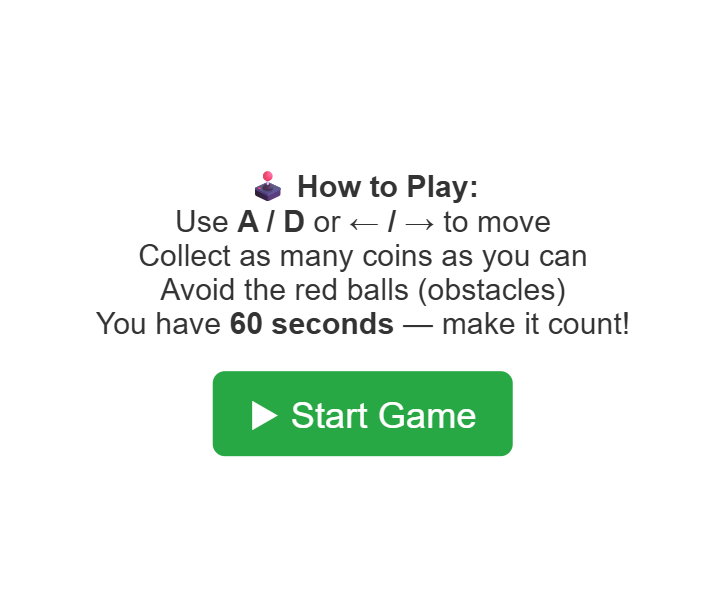
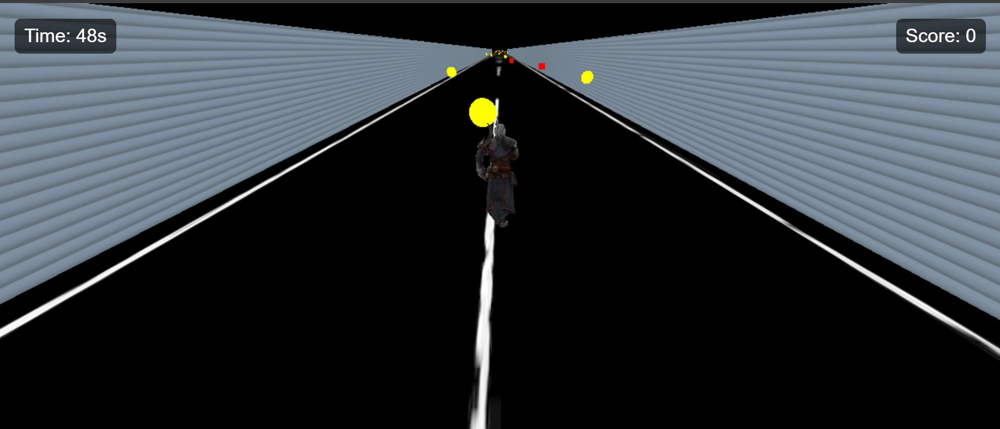
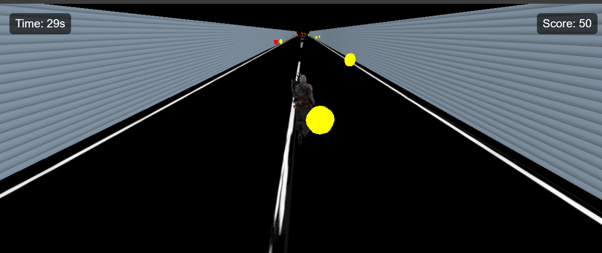
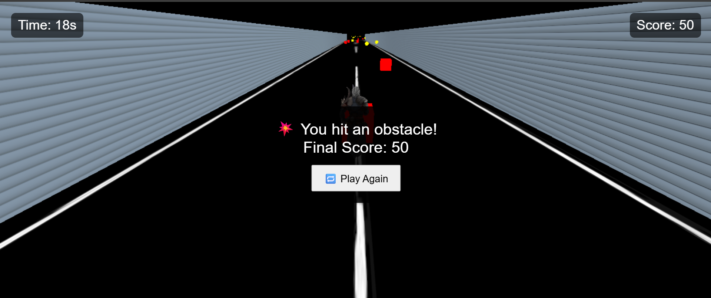
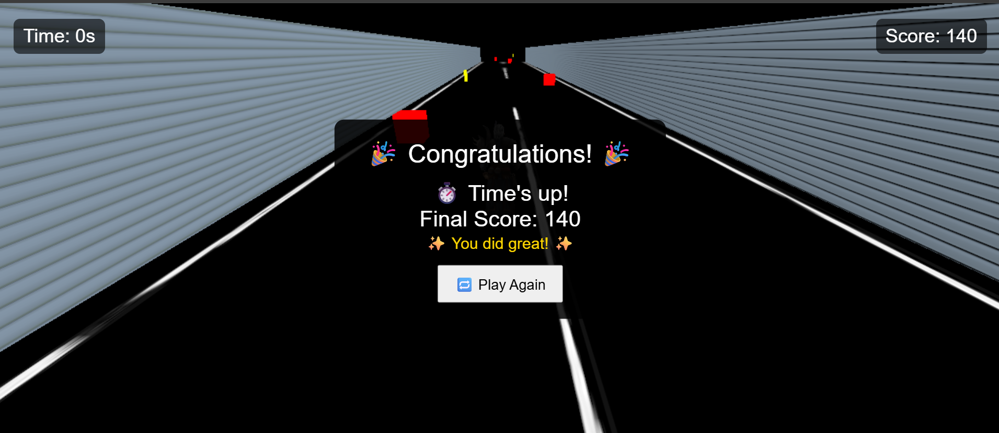

# Basic Temple Run Style Game – Three.js 🎮

A basic Temple Run–style 3D game built using **Three.js** and deployed on [Render] (https://threejsgame.onrender.com).  
Run through paths, dodge obstacles, collect coins and enjoy smooth 3D gameplay right in the browser!

---

## 🚀 Demo
👉 [Play the Game Here](https://threejsgame.onrender.com)

![Gameplay Screenshot]

Instructions:


start game with score 0 and timer runs:


collect coins and dynamically updating the score:


Hitting Obstacles:


Out of time:


---

## 🛠 Features
- 🌐 Built with [Three.js](https://threejs.org/)
- 🕹 Smooth player movement (Keyboard ⬅️➡️ Arrows, `A` & `D` keys, and touch controls)
- 🌲 Randomly generated coins & obstacles
- ⏳ Timer-based gameplay (starts at **60 seconds**, counts down to 0)
- 💰 Dynamic score updates when collecting coins
- ❌ Game ends instantly on hitting an obstacle
- 🎯 Objective: Collect as many coins as possible before time runs out
- 📜 On-screen **Game Instructions** before starting
- 🎶 Background music for immersive experience
- 🎨 Lightweight & responsive design

---

## 📦 Installation & Setup
```bash

Clone the repository:
git clone https://github.com/Aswin9630/ThreeJs.git
cd ThreeJs

Install Dependencies:
npm install

Run Locally:
npm run dev

Build for production:
npm run build

